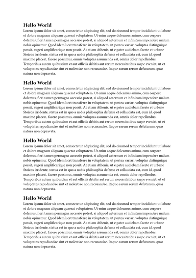
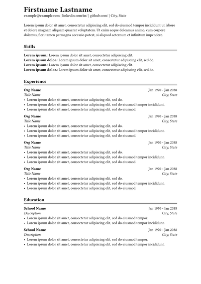

# typst-docker

Run [Typst](https://github.com/typst/typst) in Docker to recursively watch and compile `*.typ` files.


## Running

```
make up
```


## Examples

[](examples/hello-world.typ) | [](examples/resume.typ)
-- | --
